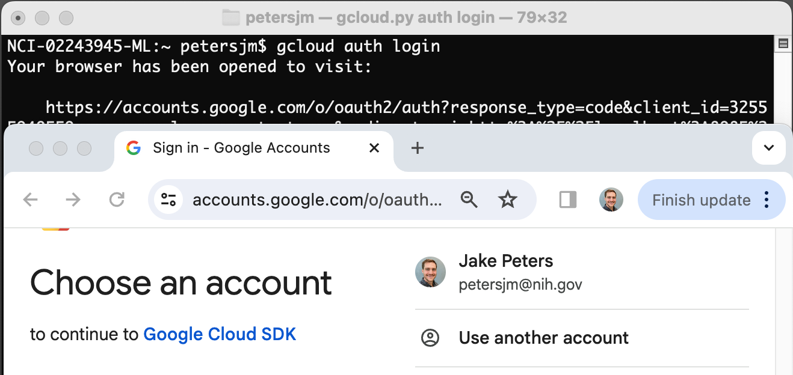
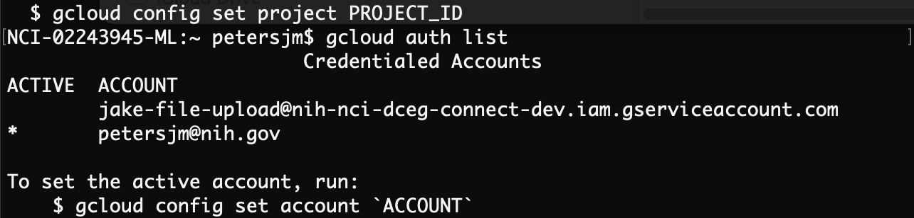
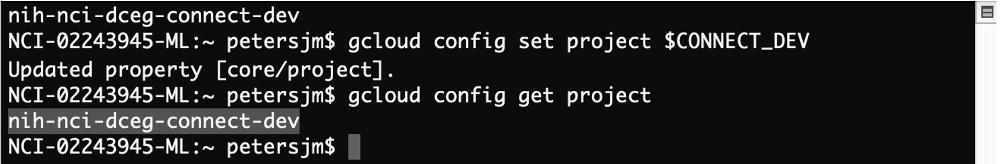
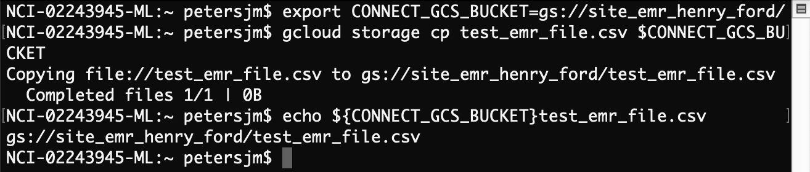

# Uploading EMR Data to a GCS Bucket

## Table of Contents

-   [Introduction](#introduction)
-   [Step-by-step Guide](#step-by-step-guide)
    -   [Step 0: Install `gcloud` CLI](#step-0)
    -   [Step 1: Login](#step-1)
    -   [Step 2: Set the GCP project](#step-2)
    -   [Step 3: Upload the file to GCS Bucket](#step-3)
-   [References](#references)

<a name="introduction"></a> 
## Introduction 

This guide provides detailed instructions on how to upload EMR files to Google Cloud Storage (GCS) using the `gcloud` CLI. This is the simplest method for uploading files to GCS buckets. However, you can also using [REST APIs](https://cloud.google.com/storage/docs/uploading-objects#rest-upload-objects) or [Google's client libraries](https://cloud.google.com/storage/docs/uploading-objects#storage-upload-object-client-libraries) in Python, C++, Java, Node.js, etcetera.

> [!NOTE]
> In order to access the GCS bucket by any of the methods listed above, you must have a Google Account associated with your institutional email address. Provide this email address to the Connect Coordinating Center who will provide you with write permissions for your site's GCS bucket.

<a name="step-by-step-guide"></a> 
## Step-by-step Guide 

<a name="step-0"></a>
### Step 0: Install `gcloud` CLI 

The Google Cloud Command Line Interface (CLI) allows you to interact with Google Cloud services, including Google Cloud Storage, directly from the command line or with scripts. Before using this tool, follow the installation guide here: <https://cloud.google.com/sdk/docs/install>

<a name="step-1"></a>
### Step 1: Login 

To log in, paste the code below in the terminal and hit `return`. You should be prompted to login in a browser window using your the email/password associated with your google account. If you are prompted with "Google Cloud SDK wants to access your Google Account", click `Allow`.

``` bash
gcloud auth login
```



To ensure that you are logged in correct, enter

``` bash
gcloud auth list
```



You should see an asterisk next to the email address associated with your google account. If you have multiple accounts and the desired account is not indicated by the asterisk, you can change the selected account with

``` bash
gcloud config set account <YOUR_EMAIL_ADDRESS>
```

<a name="step-2"></a>
### Step 2: Set the GCP Project. 

Set the Connect GCP Project IDs as environment variables.

``` bash
export CONNECT_DEV=nih-nci-dceg-connect-dev
export CONNECT_STG=nih-nci-dceg-connect-prod-6d04
export CONNECT_PROD=nih-nci-dceg-connect-prod-5519
```

Verify that they are set as expected.

``` bash
echo $CONNECT_DEV
echo $CONNECT_STG
echo $CONNECT_PROD
```

Set the project to using the appropriate environment, e.g., DEV.

``` bash
gcloud config set project $CONNECT_DEV
```

Verify that your project is set.

```         
gcloud config get project
```



<a name="step-3"></a>
### Step 3: Upload file to GCS bucket 

For convenience set your set your destination bucket and as an environment variable.

``` bash
export CONNECT_GCS_BUCKET=gs://YOUR_SITES_BUCKET
echo $CONNECT_GCS_BUCKET
```

Copy the EMR file from your local filesystem to the GCS bucket.

``` bash
gcloud storage cp <PATH/TO/YOUR_EMR_FILE.CSV> $CONNECT_GCS_BUCKET
```

Ensure that your file is uploaded to the bucket.

``` bash
gcloud storage ls ${CONNECT_GCS_BUCKET}/<YOUR_EMR_FILE.CSV>
```

If your file was successfully uploaded you should see the file listed as output in the terminal.



<a name="references"></a>
## References 

-   <https://cloud.google.com/sdk/docs/install>
-   <https://cloud.google.com/storage/docs/uploading-objects>
